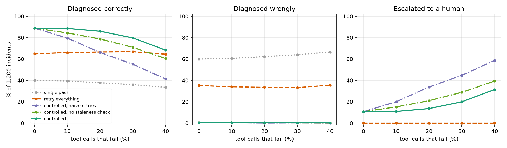

# AgentOps

[](https://github.com/asher0913/agentops/actions/workflows/ci.yml)


[](LICENSE)

An incident-investigation agent is only as good as the telemetry it reads, and telemetry in the
middle of an incident is flaky: queries time out, the metrics backend rate-limits you, a dashboard
serves a snapshot from before the incident, and the service that paged is usually a victim of
something further down. This lab measures what the control flow around the diagnosis step has to
do about that. The same diagnosis rules run under six policies on 1,200 seeded incidents, and
every tool call is recorded as a span so that any investigation can be replayed offline.

```text
$ agentops investigate --incident 28 --policy "retry everything"
   0.00s  alert on web-frontend
   0.00s  metrics(web-frontend) #1  ok  129 ms
   0.13s  logs(web-frontend) #1  ok  470 ms
   0.60s  deploys(web-frontend) #1  transient  40 ms
   0.64s  deploys(web-frontend) #2  ok  68 ms
   0.71s  -> diagnosed: bad_deploy on web-frontend          # a harmless deploy 11 min ago; wrong

$ agentops investigate --incident 28
   ...
   0.60s  deploys(web-frontend) #1  transient  40 ms
   0.64s  wait 200 ms  (transient on deploys(web-frontend))
   0.84s  deploys(web-frontend) #2  ok  68 ms
   0.91s  -> web-frontend is a victim; errors point at auth-svc
   ...
   1.89s  -> auth-svc is a victim; errors point at session-store
   ...
   2.59s  -> diagnosed: eviction_storm on session-store
{ ...
  "evidence": [
    "metrics(session-store): hit_rate=0.276",
    "logs(session-store): 'evicted keys under memory pressure' x9"
  ], ...
}
ground truth: eviction_storm on session-store
```

## Results

1,200 incidents (3 seeds × 400) on a 13-service call graph; 20% of tool calls fail (transient
errors, 2-second timeouts, rate limits) and 10% of metric reads are stale. The alert fires on the
root-cause service in 40% of incidents. In 36% of them, a victim between the alert and the root
shows an anomaly of its own: CPU throttling from retry storms, a harmless recent deploy, or old
log lines. In 10% of them, the root's metrics or logs are unavailable for the whole incident.

| Policy | Correct | **Wrong** | Escalated | Tool calls | Failed calls | Time to decision (mean / p95) |
|---|---:|---:|---:|---:|---:|---:|
| single pass (alert service only, no retries) | 37.8% | 62.3% | 0% | 3.0 | 0.70 | 0.7 s / 2.4 s |
| retry everything, answer anyway | 66.5% | 33.5% | 0% | 6.6 | 2.49 | 1.4 s / 4.0 s |
| **controlled** | **86.0%** | **0.4%** | 13.6% | 7.8 | 1.72 | 2.6 s / 6.6 s |
| controlled, naive retries | 66.2% | 0.1% | 33.8% | 9.1 | 3.42 | 1.9 s / 4.9 s |
| controlled, no staleness check | 78.8% | 0.3% | 20.9% | 7.5 | 1.66 | 2.6 s / 6.5 s |
| controlled, no evidence gate | 65.1% | 34.9% | 0% | 5.7 | 1.27 | 1.9 s / 5.4 s |

The controlled policy follows the error trail down the call graph and backs off on retryable
failures (honouring `retry-after`, never retrying `unavailable`). It re-reads metrics whose
`as_of` predates the incident, and it names a root cause only when metrics and logs agree;
otherwise it escalates.

- **The evidence gate is what prevents wrong answers.** 95–100% of the wrong answers from the
  policies that follow the trail blame a victim: a single anomaly on a service in the path is
  enough to stop the search there. Requiring metrics and logs to agree before stopping cuts
  wrong answers from 34.9% to 0.4%. The 0.4% left are victims where both sources mislead.
- **Retry policy and staleness checks decide coverage.** Retrying immediately runs into the rate
  limit again and gives up on data the controlled policy gets after one wait. Without the
  staleness check, a pre-incident snapshot hides the root's metric signal. Neither makes the
  agent wrong, because the gate holds, but they push 20 and 7 points of incidents to a human.
- **An escalation is a hand-off, not a shrug.** 75% of the controlled policy's escalations are
  incidents where the root's evidence really was unavailable. 94% name the root service and 90%
  the right cause as the unconfirmed suspect. So the gate trades about 12% of incidents that a
  guess would have got right for a wrong-answer rate below 0.5%. Whether that trade is worth it
  depends on what a wrong remediation costs.
- **Being right is slower.** Backoff and following the trail cost time: 2.6 s mean against 1.4 s
  for retrying everything and answering early.



As tool failures rise from 0% to 40%, the controlled policy keeps its wrong-answer rate under
0.5% and converts lost evidence into escalations. Retrying everything and the no-gate ablation
are 33–36% wrong at every failure rate, including 0%, because their errors come from stopping
early, not from missing data.

### Replayable traces

Every investigation is a list of spans: the alert, each tool call with its attempt number,
status, latency and response, each wait, and each decision, all on a simulated clock.
`ReplayBackend` serves a recorded trace back in order and raises `ReplayDivergence` as soon as an
agent asks for a call the recording does not contain. That turns recorded incidents into an
offline regression suite for agent changes. For 400 traces recorded with the controlled policy
(2,999 tool calls):

| Policy replayed on the recordings | Same decision | Different decision | Needs calls the recording lacks |
|---|---:|---:|---:|
| controlled (the recorder) | 400, all traces byte-identical | 0 | 0 |
| controlled, no staleness check | 336 | 0 | 64 |
| controlled, naive retries | 345 | 0 | 55 |
| controlled, no evidence gate | 235 | **165** | 0 |
| retry everything | 197 | 116 | 87 |

Removing the evidence gate never needs a new call, so replay alone flags all 165 changed
decisions for review, with no backend. Changes that need data the recording lacks are caught as
divergences and need a shadow run against live telemetry instead.

## Usage

```bash
pip install -e '.[dev]'

agentops investigate --incident 28 --trace trace.jsonl     # print the timeline, save the spans
agentops replay trace.jsonl --policy "controlled, no evidence gate"
agentops report --out results                               # all tables above (about 5 s)
python scripts/make_figures.py                              # needs matplotlib
```

## How the incidents are built

`world.py` injects one of seven root causes into one service: bad deploy, memory leak, CPU
throttling, certificate expiry, connection exhaustion, disk full or cache eviction storm. Each
cause leaves a metric signature and a log signature on that service. Every caller above it gets
more latency and errors, weaker with distance, and error logs that name the failing dependency
(`timeout calling auth-svc`); that trail is what the investigating agent follows. Distractions
are drawn at fixed rates: callers throttled by retry storms (30% per caller), a harmless deploy
in the last 40 minutes somewhere above the root (40%), and one to three log lines from an
unrelated old problem (25% per service). The diagnosis rules (`METRIC_TESTS`, `LOG_SIGNATURES`)
stand in for an LLM reading the telemetry. Every policy uses the same rules, so the differences
come from control flow alone.

## Tests

`pytest -q` runs 12 tests:

- incidents are deterministic, and every root shows its cause in both sources;
- the trail of victims leads to the root;
- fault draws are reproducible, and rate limits hold for their window;
- `unavailable` is not retried, waits equal `retry-after` or the backoff schedule, and stale
  metrics are re-read;
- the gate keeps searching past a victim that looks guilty, and missing evidence is escalated
  with the suspect named;
- replay is exact and detects divergence;
- the headline ordering holds, naive retries lose coverage as faults rise, and the CLI trace
  round-trips.

## Limitations

- The incidents are synthetic, with one root cause each and a tree-shaped call graph. Real
  incidents have several contributing causes, shared dependencies and cycles, so the error trail
  can fork.
- The distraction rates are parameters, not measurements. The size of the no-gate failure (35%)
  follows from them; the direction does not.
- The diagnosis rules are exact thresholds. An LLM reading the same telemetry would be noisier
  and would need the gate more, not less.
- Replay serves recorded responses as they were. A policy that waits a different amount of time
  gets the recorded response, not what a rate limiter would have said at the new time.

## License

MIT
